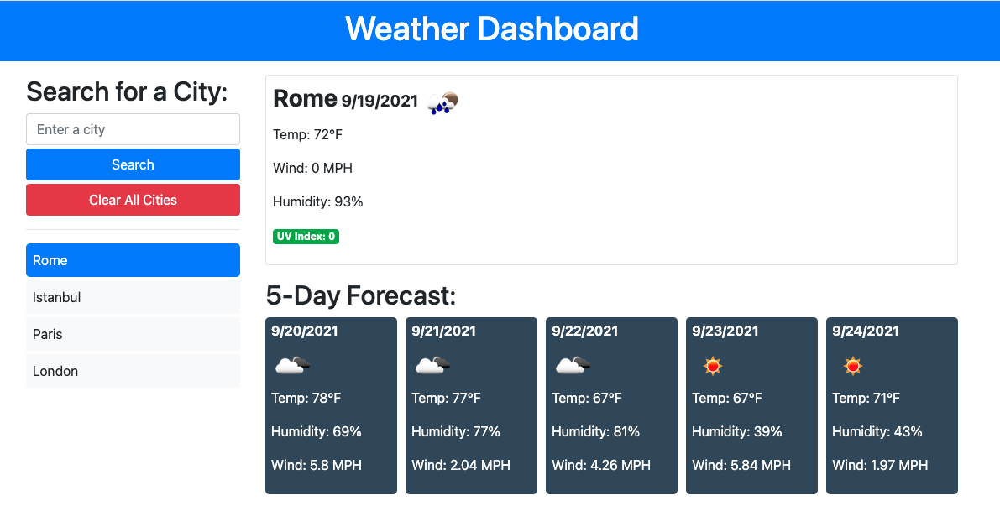

# Weather Dashboard

Version 1.0.0

### Live Application Link on GitHub Pages👀
Weather Dashboard: [See deployment on Github Pages](https://adamromano89.github.io/weather_dashboard/)

### Live Application Link 👀
Weather Dashboard: [https://adamromano89.github.io/weather_dashboard/]
### Built With 🧰
- HTML 
- CSS
- Bootstrap
- JavaScript

# Project Visual :sunglasses:

## Authors, Acknowledgement, & Resources 🤝
##### Adam Romano - Full Stack Web Developer
##### Hamza Nabil - Senior Software Engineer

### Teaching Crew at University Of Texas 🎉
[UT](https://www.utexas.edu/)